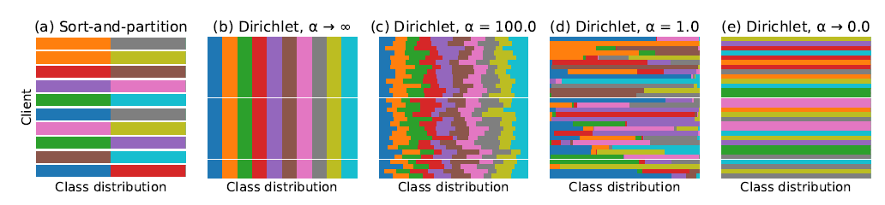

# Non-IID-Dataset-Generator-Direc-Delta

[Won Joon Yun](https://sites.google.com/view/wonjoonyun)

--

**_Reference_**

[Hsu, Tzu-Ming Harry, Hang Qi, and Matthew Brown. "Measuring the effects of non-identical data distribution for federated visual classification." arXiv preprint arXiv:1909.06335 (2019).](https://arxiv.org/pdf/1909.06335.pdf)

--

